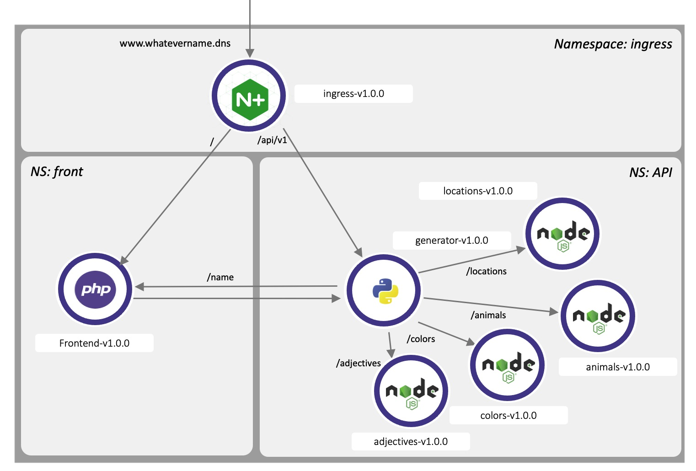
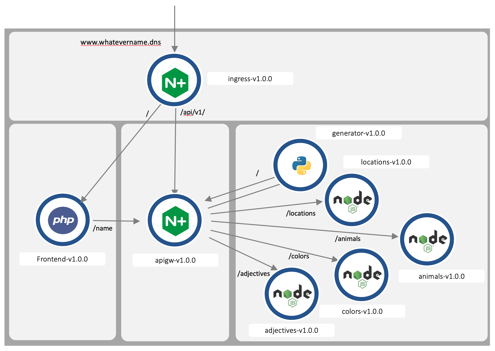

# Description
This is a very simple kubernetes demo application intended to show most of the benefits of using F5 Technology for your application delivery and security.
It is composed of multiple technology frameworks.

This app will generate a sentence :)


# Lab Documentation
## Lab 1: Deploy the application in your k8s environment

In this section, we will deploy the application as below, where the generator will `GET` each micro-service to get a `WORD`. 

> The Ingress Controller will not be deployed in this lab.
s
  

Then, the generator will provide with such output:

``` json
{
    "adjectives": "proud",
    "animals": "lion",
    "colors": "blue",
    "locations": "park"
}
```

Then, the frontend web application will `display` all the `words` in a `sentence`. If one micro-service is not deployed, the word is not displayed.

In term of micro-services, this is how there are used by the Webapp frontend.

  


> You can find the lab guide to deploy the app and the steps here: [Task1: Deploy the application](docs/task1/README.md)


## Lab 2: API Management
  **Goal**

  Deploy an API Gw in Kubernetes managed by Nginx Controller. And scale this Gateway in K8S with auto-adoption by the controller.

  Deploy and Ingress Controller to route the traffic to:
    
  - The Web Application frontend if the path EQUALS /
  - The API Gateway is the path starts with /api/

  **The Workflow:**

  In this lab, the `workflow` is a little bit different. All the API routing is done by the API Gateway. It means, the `generator` will reach the API Gw to GET the `WORD` micro-services.

  This will allow us to controle the API access and routing, authentication and authorization.


  **Features:**
  - NGINX Controller API Management
  - NGINX Ingress Controller
  
  


# Courtesy of:
Thanks to https://www.npmjs.com/package/json-server for the zero coding JSON Server.